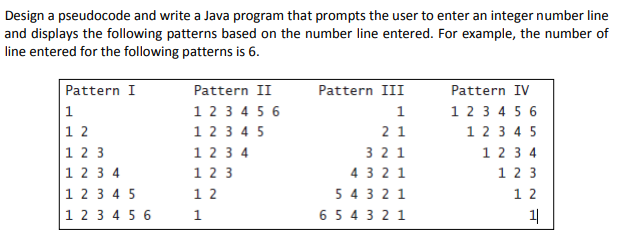

# Number Pyramids

## Introduction

I saw this question on Stack Overflow.

I thought the code required to create the output in the image would lead to an interesting discussion.

Here's the output from two of my test runs.

     Pattern I      Pattern II     Pattern III    Pattern IV     
     1              1 2 3 4 5 6              1    1 2 3 4 5 6
     1 2            1 2 3 4 5              2 1      1 2 3 4 5
     1 2 3          1 2 3 4              3 2 1        1 2 3 4
     1 2 3 4        1 2 3              4 3 2 1          1 2 3
     1 2 3 4 5      1 2              5 4 3 2 1            1 2
     1 2 3 4 5 6    1              6 5 4 3 2 1              1

     Pattern I          Pattern II         Pattern III        Pattern IV         
     1                  1 2 3 4 5 6 7 8                  1    1 2 3 4 5 6 7 8
     1 2                1 2 3 4 5 6 7                  2 1      1 2 3 4 5 6 7
     1 2 3              1 2 3 4 5 6                  3 2 1        1 2 3 4 5 6
     1 2 3 4            1 2 3 4 5                  4 3 2 1          1 2 3 4 5
     1 2 3 4 5          1 2 3 4                  5 4 3 2 1            1 2 3 4
     1 2 3 4 5 6        1 2 3                  6 5 4 3 2 1              1 2 3
     1 2 3 4 5 6 7      1 2                  7 6 5 4 3 2 1                1 2   
     1 2 3 4 5 6 7 8    1                  8 7 6 5 4 3 2 1                  1

I made extensive use of the format method of the [String](https://docs.oracle.com/javase/8/docs/api/java/lang/String.html#format-java.lang.String-java.lang.Object...-) class.  The format parameter uses the [Formatter](https://docs.oracle.com/javase/8/docs/api/java/util/Formatter.html) class to interpret the format parameter.  There are lots of format options available with the Formatter class, but we're going to use 3 format parameters.

    %2d - right justifies an int to two characters
    %-30s - left justifies a String to 30 characters
    %30s - right justifies a String to 30 characters

The first thing I did was get the length of the String of the largest integer or range.  Either 6 or 8 gives me a length of 1.

Next, I created a String format to display the number with two characters, a space and the digit.

    String format1 = "%" + length + "d";
    format1 = %2d
    
This String format allowed me to create one of the number lines.

     1 2 3 4 5 6
     
Once I created this line, I knew how wide each column had to be.  In the case of 6, the column width had to be at least 12.  I added 3 characters to give the columns some spacing.

After I had the column widths, I could create the header.

Then, I created the four number lines in a for loop, one increment for each line.

After I got everything working, I refactored the code into methods.  I did this so each method would be easier to understand, and thus, the whole application would be easier to understand.
